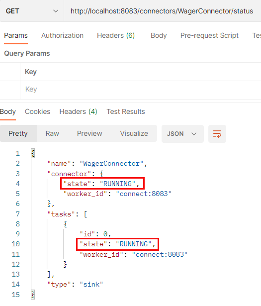

# Stream Data from Kafka to Azure Data Explorer

You who follow my [blog][9] know that I am a big fan of **Apache Kafka** and [**Azure Data Explorer**][2]. I have written several blog posts about these two technologies, and I have a section about setting up Kafka and ADX in each post. I thought it would be beneficial to summarise the details, and this repo, together with this `README.md`, is that summary.

What I cover here is very much based on the **Develop a Real-Time Leaderboard Using Kafka and Azure Data Explorer** blog post series. All examples, code, etc., are taken from that blog post series.

## Pre-Reqs

The pre-reqs for this are very much the same as for the section from the [**Develop a Real-Time Leaderboard Using Kafka and Azure Data Explorer - I**][1] blog post:

* Docker Desktop. We use Docker to "spin up" containers for Kafka and a Python application. The Python application generates and publishes events to Kafka.
* An Azure account. If you don't have an Azure subscription, sign up for a [free account][3].
* Azure CLI. The Azure CLI is a cross-platform command-line tool connecting to Azure and executing administrative commands on Azure resources. You find downloads and install instructions [here][6].
* An Azure Data Explorer cluster and database. To set up an ADX cluster and a database, look here: [Quickstart: Create an Azure Data Explorer cluster and database][4]. I suggest you name the database the same name I use: `leaderboard`. However, it is up to you. Please note that there may be a cost associated with the ADX cluster, so be sure to tear it down when you are done. The assumption is that you now have a running ADX cluster or you set it up as per the instructions in the [link][4].

You may have seen how ADX offers [free clusters][5]. A free cluster allows you to explore the platform's features, experiment with data analytics queries, and develop proofs of concept without incurring any cost. This would have been ideal for our purposes, but unfortunately, a free cluster does not allow streaming ingestion, which we will be using here.

## Kafka

In case someone doesn't know what Kafka is: Apache Kafka is a distributed streaming platform. It is designed to handle large volumes of real-time data streams and enable real-time data processing and analysis. Kafka is built on top of the publish-subscribe messaging model, where producers publish messages to topics, and consumers subscribe to those topics to receive and process the messages. It uses a distributed architecture that allows it to scale horizontally across multiple servers and handle large amounts of data:


**Figure 1:** *Kafka*

You see in *Figure 1* what is mentioned above. In the middle, you have a Kafka cluster (in this case, three nodes), where the topics are distributed over the nodes. At the left, you have multiple publishers publishing events to topics in the Kafka cluster. On the right, you have consumers consuming these events from topics.

The consumers process the events, and potentially the consumers write the events to other systems.

### Kafka Connect

Above, I mentioned that consumers may write the events to other systems. Instead of writing explicit code in the consumers for pushing events to other systems, you can use Kafka Connect.

Kafka Connect is a framework that integrates external systems with Apache Kafka. It provides a scalable, fault-tolerant way to stream data between Kafka topics and other data sources or sinks.

Kafka Connect consists of two main components:

* Connectors: A connector is a plugin that connects to an external system and defines the configuration and operations required to read from or write to that system. Connectors can be developed and installed independently of Kafka Connect.
* Connect worker: A connect worker is a Java process that manages the execution of connectors, including scaling, failover, and parallel data processing. The connect worker runs on a separate machine or cluster from Kafka brokers and coordinates the data flow between connectors and Kafka.

Kafka Connect supports a wide range of connectors, including databases, files, messaging systems, and cloud services. By leveraging connectors, data can be easily and efficiently ingested into Kafka from a variety of sources or pushed from Kafka to other data stores or systems:


**Figure 2:** *Kafka Connect*

In *Figure 2* you see from left to right:

* Source systems, i.e. systems you want to get data from. These systems can be databases, Hadoop, file systems, etc.
* The Kafka Connect worker with source connectors. The connectors know how to interact with the source system, whether querying a database, using CDC, reading from a filesystem, etc. The connectors publish data to Kafka topics.
* The Kafka broker(s). The broker(s) contain topics that are the "sinks" for the source connectors.
* Kafka Connect worker with sink connectors. Source and sink connectors can be in the same Kafka Connect worker. The sink connectors know how to consume and ingest events from Kafka topics into sink systems.
* Sink systems. These are systems you ingest data into. As with source systems, these can be databases, Hadoop, filesystems, etc.

Now, knowing a little bit about Kafka and Kafka Connect, let's drill into Azure Data Explorer.

## Azure Data Explorer

[Azure Data Explorer][2] is a fully managed data exploration service provided by Microsoft Azure. It is designed for big data scenarios and allows users to quickly and easily analyze large amounts of data using a SQL-like language. ADX can handle structured and unstructured data and can be used to perform tasks such as data exploration, real-time analytics, and visualization.

It uses a distributed columnar storage system and a query engine designed to handle complex queries and perform well even with massive datasets. Additionally, ADX uses advanced indexing and caching techniques to speed up queries and reduce the need for full table scans. It also allows for near real-time data ingestion and supports complex data types such as JSON and Avro.

### Azure Data Explorer Kusto Sink Connector

The **Azure Data Explorer Kusto Sink Connector** (Kusto Sink) is a connector for Kafka Connect that enables data streaming from Apache Kafka to Azure Data Explorer. 

The Kusto Sink Connector can be used to ingest real-time data from Kafka topics into Azure Data Explorer tables, where it can be analyzed and visualized using tools such as Power BI or Excel: 


**Figure 3:** *Kusto Sink Connector*

You see in *Figure 3* almost the same picture as in the [**Develop a Real-Time Leaderboard Using Kafka and Azure Data Explorer - I**][1] blog post:

1. A player makes a spin. This generates a spin event which is published to a topic in Kafka.
1. The event is ingested into ADX using Kafka Connect and the Kusto Sink connector.
1. You query/analyze/visualize the data. 

Let's see how you can put this together.

## ADX Setup

As per the [Pre-Reqs](README.md#pre-reqs) section above, the assumption is that you now have a working ADX cluster with at least one database.

You start with setting up ADX:

* Create a service principal. The SPN is used by the connector to connect to ADX. 
* Create a table to ingest the data into. 
* Enable streaming ingestion on the cluster, database and table.

In addition to the above, you also need to get the ADX endpoints for ingestion and querying. Let us do that now.

### Query / Ingestion Endpoints

ADX exposes the ability to ingest and query data through endpoints (URLs), and you can see these URLs as connection strings. You have one endpoint for querying and one for ingestion. To get the URLs, you browse to the overview page for the ADX cluster in the Azure Portal: 


**Figure 4:** *Connection Strings*

You look for the two endpoints outlined in red in *Figure 4*. Those two endpoints represent the following:

* `URI`: endpoint for querying the cluster.
* `Data Ingestion URI`: this is the endpoint for ingesting into the cluster.

Take note of the two endpoints. You will use them later.

### ADX Service Principal (SPN)

To set up the SPN, you use the Azure CLI mentioned above in the [Pre-Reqs](README.md#pre-reqs) section. This is what you do:

* Log in to Azure: `az login`. This returns a list of your subscriptions after successful login.
* If you have more than one subscription, you set the subscription you want to use: `az account set --subscription <your-sub-id>`.

After logging in and setting the subscription, you create the service principal:

```bash
az ad sp create-for-rbac -n "leaderboard-adx-spn"
```
**Code Snippet 1:** *Create Service Principal*

As mentioned, the code in *Code Snippet 1* creates a service principal (essentially a user) configured to access Azure resources. The output, when executing the code, looks something like so:


**Figure 5:** *Service Principal Properties*

In *Figure 5*, you see the result from executing the code in *Code Snippet 2*. You see a JSON blob with 4 fields/properties. Take note of `appId`, `password`, and `tenant`, as you will now create a user in your database from the SPN.

There are different ways to do this, and I find using the *Query* editor for ADX in the Azure Portal the easiest:


**Figure 6:** *Query ADX Azure Portal*

In *Figure 6*, I logged in to my Azure subscription and navigated to my ADX cluster (highlighted in yellow). I then:

* Clicked on the *Query* button outlined in red.
* Did chose my database `leaderboard` outlined in blue.

By clicking on the *Query* button, the query editor opens. You see it outlined in purple in *Figure 6*. You also see - outlined in green - the code to execute to add the created SPN to the database. 

> **NOTE:** You replace the `The-AppId` and `The-Tenant` with the values for `appId` and `tenant` you got when executing the code in *Code Snippet 1*.

The code in **Figure 6* is in the [`kql-queries.kql`](kql/kql-queries.kql) file in this repo's `kql` folder.

### ADX Table

When ingesting data from a Kafka topic into ADX, you ingest it into an ADX table. When ingesting the data, you can ingest it as a blob (as is) and process it afterwards or ingest it so it matches the events schema. Here you want to ingest it so it matches the schema:

``` json
{
  "playerId": Int32, 
  "gameId": Int32,
  "win": Int64,
  "stake": Int32,
  "eventTime": DateTime
}
```
**Code Snippet 2:** *Event Schema*

With the schema, you see in *Code Snippet 2* in mind, the table looks like so:

``` sql
.create table GamePlay 
(
  PlayerID: int, GameID: int, 
  Win: long, Stake: int, 
  EventTime: datetime
)
```
**Code Snippet 3:** *Create Table*

The table creation code in *Code Snippet 3* is in the [`kql-queries.kql`](kql/kql-queries.kql) file. 

## Ingestion

ADX supports multiple types of ingestion. Here you will be using streaming ingestion, which requires enabling it for the cluster. In addition to the cluster, streaming ingestion must be enabled for the database or the table (or both).

### Cluster

The easiest way to enable streaming on the cluster is via the Azure Portal:


**Figure 7:** *Enable Stream Ingestion ADX Cluster*

In *Figure 7* you see how I have browsed to my ADX cluster in the Azure Portal. There I:

* Under the *Settings* heading select *Configurations* (outlined in yellow).
* In the *Configurations* pane, select **On** to enable *Streaming ingestion* (outlined in red).
* Click *Save* just above *Configurations*.

Be aware that it may take some seconds, up to half a minute, for ADX to enable streaming ingestion.

### Database

I mentioned above how, in addition to enabling streaming on the cluster, you must enable it on the database and/or table. Here you do it on the database level. You enable streaming by executing a **Kusto Query Language** (KQL) query from the *Query* editor for ADX in the Azure Portal:

``` sql
.alter database leaderboard policy streamingingestion enable
```
**Code Snippet 4:** *Enable Streaming Ingestion Database*

When you have executed the code in *Code Snippet 4*, you can check that it has worked by executing `.show database leaderboard policy streamingingestion`.

### Ingestion Mapping

Above, I mentioned how you want to ingest the data from the topic so it matches the schema. You created a table in *Code Snippet 3* to do that. Even though you have a table that matches the event schema, you still need to indicate to ADX how the events fields map to the table's columns. You do that by creating an ingestion mapping:

``` sql
.create table GamePlay ingestion json mapping 'gameplay_json_mapping' 
'['
'  {"column":"PlayerID", "Properties":{"path":"$.playerId"}},' 
'  {"column":"GameID", "Properties":{"path":"$.gameId"}},' 
'  {"column":"Win", "Properties":{"path":"$.win"}},' 
'  {"column":"Stake", "Properties":{"path":"$.stake"}},' 
'  {"column":"EventTime", "Properties":{"path":"$.eventTime"}}' 
']'
```
**Code Snippet 5:** *Create Ingestion Mapping*

Since the event is a JSON blob, you create a JSON mapping. You see in *Code Snippet 5* how the columns in the table are mapped against the event fields, where `$` represents the event's root. The code for this is in the [`kql-queries.kql`](kql/kql-queries.kql) file in this repo's `kql` folder.

Now ADX should be set up to ingest data from a Kafka topic. However, to have a topic, we need a Kafka cluster. Let's fix that.

## Kafka Components

To create a Kafka cluster and Kafka Connect, you use Docker and the [`docker-compose-new.yml`](/docker/docker-compose-new.yml) file in the `docker` folder in this repo:


**Figure 8:** *Docker Compose*

In *Figure 8*, you see an excerpt of the [`docker-compose-new.yml`](/docker/docker-compose-new.yml) file. The picture shows (in my opinion :smile:) the most interesting parts of the file:

* Outlined in yellow: `kafka-ui`. If you need a UI for your Kafka, ksqlDB, etc., cluster, this is a nice UI. The UI is exposed on port `8080` (i.e. `localhost:8080`). Give it a try!
* Outlined in light green: `connect`. This is the Kafka Connect container. Notice that the image is not the `confluentinc/cp-server-connect-base` image but custom-made: `nielsb/kafkaconn-kustosink`. This image is based on Confluent's, but the Kusto Sink Connector comes pre-installed. You can read more about this image [here][8].
* Outlined in blue `kafka-init-topics`. This container creates the `gameplay` topic you will publish to. You see the code for the topic creation in the `command` section. After having created the topic, the container will exit.
* Outlined in white: `event-gen`. This is the container that generates events and publishes them to a topic. The container is based on the Dockerfile in this repo's `docker/build` folder.

Let's start the cluster (and the other containers).

### Spin 'er Up

To spin up the Kafka cluster and the other containers, you execute the following command from the `docker` folder in this repo (ensure Docker Desktop is up and running before you run the code):

``` bash
docker compose up -d --build
```
**Code Snippet 6:** *Spin Up Kafka Cluster*

I use the `--build` flag you see in *Code Snippet 6* because if I have made changes to any source file for the `event-gen` container, I want to ensure the container is rebuilt.

When you have executed the code in *Code Snippet 6*, you can check that the cluster is up and running by executing the following command:

``` bash
docker ps --format "table {{.Names}}"
```
**Code Snippet 7:** *Check Kafka Cluster*

The output from the code in *Code Snippet 7* should look something like so:


**Figure 9:** *Kafka Cluster Up and Running*

It looks like everything has worked, as in *Figure 9* you see that the `connect` container is up.

#### Installed Connectors

From the above, it seems all is OK. To be sure, you check that the Kusto Sink connector is loaded into Kafka Connect. You do it by using the Kafka REST API:

``` bash
GET http://localhost:8083/connector-plugins
```
**Code Snippet 8:** *Check Connectors*

You can use whatever tool you are comfortable with to call the REST API (`curl`, Postman, etc.). Personally, I prefer Postman, and in *Code Snippet 8*, you see how I call into the `connector-plugins` endpoint using port `8083` exposed by Kafka Connect:


**Figure 10:** *Kafka Connectors*

Yup, all is working. You see in *Figure 10* how the Kusto Sink connector is loaded.

## Event Generation

Now that you have Kafka up and running let's ensure you can publish events to the `gameplay` topic. You do that by using the `event-gen` container. The container is a Python application that uses the Confluent Kafka Python client to publish events. The code for the application is in the `app` folder in this repo. The [Dockerfile](/docker/build/Dockerfile) used to build the container is in the `docker/build` folder. Below I cover how to run the application, but if you want a more detailed description, you can read about it in the [Develop a Real-Time Leaderboard Using Kafka and Azure Data Explorer - Prelude][10] blog post.

> **NOTE:** The `event-gen` container is not meant to be used in production. It is a simple application that generates and publishes events to a topic. It is intended to be used for testing purposes only.

When you go to the `app` folder in this repo, you see the following files:

* [`gameplay.py`](/app/gameplay.py): Source for generating and publishing the events to a topic.
* [`runConsumer.py`](/app/runConsumer.py): Source for consuming events from a topic.
* [`runProducer.py`](/app/runProducer.py): Source for publishing events to a topic.

Here I look closer at `runConsumer.py` and `runProducer.py`.

### Consume

To consume events, you run the `runConsumer.py` file, a simple Python script that consumes events from a topic and prints them to the console.

The consumer expects some command line parameters at startup, which you can read more about in the [Develop a Real-Time Leaderboard Using Kafka and Azure Data Explorer - Prelude][10] blog post. Here you use the `--topic` (`-t`) parameter to specify the topic to consume from. 

To start the consumer, you need to `docker exec` into the `event-gen` container and its `bash` shell, and there execute `runConsumer.py`:


**Figure 11:** *Consumer*

In *Figure 11*, you see the following:

* You launch a `bash` terminal in the `event-gen` container (outlined in blue).
* After launching the terminal, you execute the Python script (outlined in red).

The consumer is now up and running, and you can start publishing events to the `gameplay` topic.

### Publish

To publish events to a topic, you run the `runProducer.py` script, The script calls into `gameplay.py` to generate an event, and then it publishes it. The producer can run in two "modes":

* **Single event**: In this mode, the producer generates a single event and publishes it to the topic.
* **Continuous**: In this mode, the producer generates events continuously and publishes them to the topic.

By default, the producer runs in "single event" mode. You can change the mode by setting the `--loop` (`-l`) parameter. To start the producer, you need to `docker exec` into the `event-gen` container and in there, execute `runProducer.py`:


**Figure 12:** *Producer*

Publishing events like in *Figure 12* is similar to what you saw in *Figure 11*: You launch a `bash` terminal in the `event-gen` container and then execute the Python script. The difference is that you now execute `runProducer.py` instead of `runConsumer.py`.

If everything is working as expected, you should see the event outlined in yellow in *Figure 12* printed to the consumer console:


**Figure 13:** *Consumed Event*

There you have it! The event outlined in yellow in *Figure 12* is also in *Figure 13! You have now verified that you can publish events to the `gameplay` topic and consume them.

I now suggest you tear down (`docker compose down`) and restart (`docker compose up -d --build`) your Docker containers to "clean up".

## Configure Kusto Sink Connector

Now that you have verified that you can publish events to the `gameplay` topic, it is time to configure the Kusto Sink connector. You configure the connector so it knows where to read data from, where to write it to, authentication settings, etc.

The connector is configured using a JSON file. The file is in this repo's `kafka/connect` folder. The file is called `connector-config.json`, and it looks like so:


**Figure 14:** *Connector Config*

Below follows an explanation of some of the fields you see in *Figure 14*:

1. The `topics` property points to the topic(s) the connector consumes. It is defined as a comma-delimited string.
1. In the `kusto.ingestion.url` and the `kusto.query.url, you set the URLs you retrieved in *Figure 4*. 
1. The three `aad.auth.xyz` properties refer to the properties from creating the SPN. The `authority` is the `tenant`, `appid` is the `appId, and the `appKey` is the `password`.
1. Let me return to `kusto.tables.topics.mapping` below.
1. I have found that I need to set both `key.converter.schemas.enable` and `value.converter.schemas.enable` to `false`. I get some errors otherwise.

### Table Topics Mapping

Above, you created an [ingestion mapping](README.md#ingestion-mapping) in ADX. That was for ADX to understand what to do with the data it ingests. The Kusto Sink connector also needs to know what to do with the data it consumes from the topic. This is where the `kusto.tables.topics.mapping` property comes in. It defines the mapping between the topics and the table(s) in the database(s). My mapping (as in *Figure 14*) looks like so:

``` json
[{'topic': 'gameplay','db': 'leaderboard', 'table': 'GamePlay',' \
   format': 'json', 'mapping':'gameplay_json_mapping', 'streaming': 'true'}]
```
**Code Snippet 9:** *Tables Topics Mapping*   

The mapping is an array of topics and their respective mapping to databases and tables in the cluster. In my example, I have only one mapping, and in the mapping, I define:

* The topic I am consuming from.
* The database and table to ingest that particular topic's events into.
* The format of the data.
* The ingestion mapping that has been set up for the table. You see this in *Code Snippet 5*.
* Whether the ingestion is streaming or batch. This post is streaming ingestion as you want as low latency as possible.

When you have set the different properties in the configuration, you `POST` the configuration to the `connectors` endpoint:


**Figure 15:** *POST Connector Config*

You see in *Figure 15* the `POST` command to create the connector outlined in red. The `name` property outlined in yellow is an arbitrary string. You use it when managing the connector. Things you can do are:

* pause the connector.
* restart the connector.
* delete the connector.
* check the status of the connector.
* etc.

Each operation is against the `/connectors` endpoint and takes the connector name as an input parameter, potentially followed by a resource request. An example would be that when we have created the connector as in *Figure 15*, we want to check that it actually is up and running:

``` bash
GET http://localhost:8083/connectors/WagerConnector/status
```
**Code Snippet 10:** *Connector Status*

You see in *Code Snippet 10* the `GET` command to check the status of the connector using the `status` resource request.

When you run the command, you should see something like so:



**Figure 16:** *Connector Status*

Yay! Everything is OK! The connector is up and running. Let's test it.

## Test Kusto Sink Connector

The connector is ready to consume events from the `gameplay` topic and ingest them into the `GamePlay` table in the `leaderboard` database. Ensure the `GamePlay` table is empty before you start testing. Run the following command in the ADX Web UI: `GamePlay | count`. If `count` returns non-zero, clear out the data from the table: `.clear table GamePlay data`.

### Single Event Mode

Let's test the connector by publishing events to the `gameplay` topic. Initially, you publish in "single event" mode as in the [Publish](README.md#publish) section above:

* Exec into `event-gen`'s bash shell: `docker exec -it event-gen bash`
* In the shell, run the producer script: `python runProducer.py -t gameplay`.
* Click `Y` a couple of times when prompted to publish events to the topic.

Having done the above, in the *Query* editor, do the equivalent of a SQL `SELECT * FROM GamePlay`: `GamePlay`:


**Figure 17:** *Ingest Events*

Yay, it works! In *Figure 17* you see the result of the query. 

You are now ready to do a more realistic test where you generate and publish events in a loop. However, before that, clear out the `GamePlay` table, so you start afresh: `.clear table GamePlay data`.

### Continuous Event Mode

In this mode, you need - at a minimum - to set the following command line parameters:

* `-t`: The topic to publish to.
* `-l`: Flag to indicate you want to loop.

Those are the only required parameters. Executing with those parameters would generate 10 events in a loop. However, let's do some more:

``` bash
python runProducer.py -t gameplay -l -e 500
```
**Code Snippet 11:** *Ingest in Continous Mode*

The code in *Code Snippet 11* generates 500 events in a loop (as set by the `-e` parameter). Execute the code, and while it is running, execute the following query in the *Query* editor: `GamePlay | count`. You should see the number increase as the events are ingested.

To verify that you really are streaming data into ADX, you can use some **Kusto Query Language** (KQL) "magic":


**Figure 18:** *Realtime Streaming*

In *Figure 18* you see how you use the `ingestion_time()` function to get the time of ingestion into ADX. You use that with the events `EventTime` property to calculate the difference between when the event was generated and when it was ingested into ADX. When I run this on my dev machine, I see that the difference is below 500 milliseconds for most events. That is pretty good, seeing that the Kafka cluster I publish the events to is in South Africa (my dev machine), and the ADX cluster is in Azure North Europe. 

## Summary

In this repo you have all "ingredients" and code to stream data from Kafka into ADX.


[1]: https://nielsberglund.com/post/2023-03-19-develop-a-real-time-leaderboard-using-kafka-and-azure-data-explorer---i/
[2]: https://docs.microsoft.com/en-us/azure/data-explorer/
[3]: https://azure.microsoft.com/en-us/free/
[4]: https://docs.microsoft.com/en-us/azure/data-explorer/create-cluster-database-portal
[5]: https://learn.microsoft.com/en-us/azure/data-explorer/start-for-free-web-ui
[6]: https://learn.microsoft.com/en-us/cli/azure/install-azure-cli
[7]: https://en.wikipedia.org/wiki/Online_gambling
[8]: https://nielsberglund.com/post/2023-04-17-cross-platform-compatibility-made-easy-with-multi-platform-docker-images-azure-data-explorer-sink-connector--kafka-connect/
[9]: https://nielsberglund.com/
[10]: https://nielsberglund.com/post/2023-02-26-develop-a-real-time-leaderboard-using-kafka-and-azure-data-explorer---prelude/